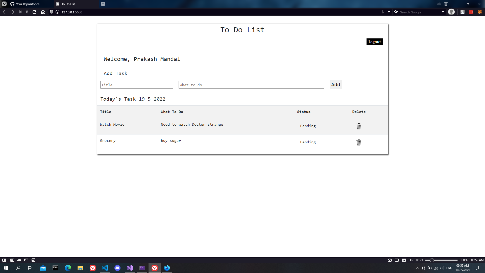
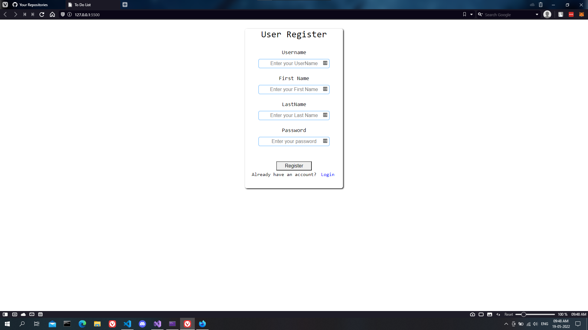
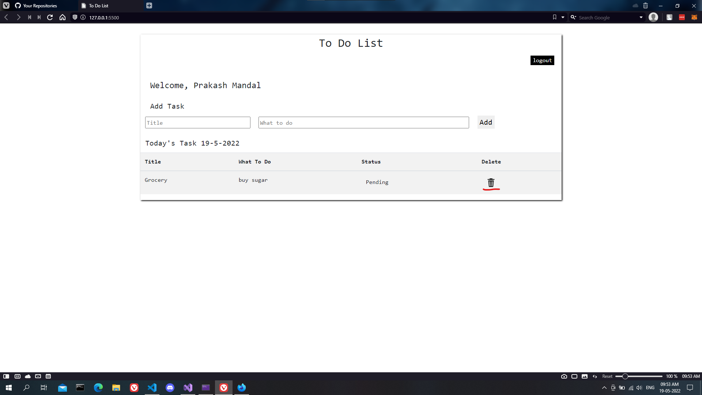

# To_do_list
A to do list app made in web api .net framewrok 6.0 with MS SQL server with login and registration function

## Database 
SQL server - [Repo](https://github.com/PrakashMandal-IV/To_Do_List_DataBase)

## FrontEnd
Made in html css and js for this api [Repo](https://github.com/PrakashMandal-IV/To_do_list_FrontEnd) 
this is single page html file 

## Dependencies
Microsoft EntityFrameWorkCore
 
Microsoft EntityFrameWorkCore.SqlServer
 
Microsoft.AspNetCore.Authentication.JwtBearer

## **Note**
If the address of the backend is something other then **localhost:5003**
 
then change is at line 13 of front end javascript once , it will change all the endpoint list

## Login
I used SHA256 hasing alogrithm for hasing password 

## Register

## Register

## Status change 

## Delete task

